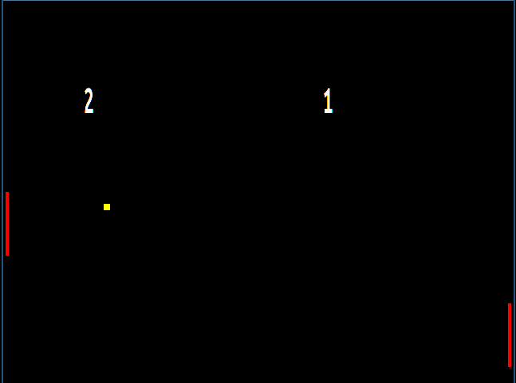

# pong

My implementation of Pong, written in C and using SDL2. It has a CPU
player, which is actually quite dumb.

## TODO
- Make ball bounces more physically accurate
- Make CPU player more "clever"
